# Portfolio

## Project: Predicting Depression in Teenagers Using Social Media and Lifestyle Factors

### Executive Summary
The UK Government recently announced a ban on social media for under-16s in an attempt to improve children’s online safety (Department for Science, Innovation and Technology, 2026). This project aims to investigate the relationships between social media and teen mental health by exploring two questions: firstly, can depression in teenagers be predicted through their social media usage; and secondly, does the relationship between social media and depression differ for those aged under-16 and those aged 16-19?
Using a public dataset containing information on the lifestyle and mental health of 1200 people aged 13-19, a Logistic Regression model was built to predict depression based on social media, demographic and lifestyle variables. An interaction feature was also included to explore whether the effect of social media varies across age groups. The model demonstrated strong predictive performance despite a significant class imbalance. Results indicated a statistically significant relationship between social media usage and depression, however found insufficient evidence that this relationship differs for under-16s compared to those aged 16+. This would suggest that social media is associated with depression risk, and this risk appears to extend across all adolescents, not just those under 16.

### Data Infrastructure & Tools
This project was completed using Python. While the dataset was small enough to be handled in other tools such as Excel, Python and its packages provide an end-to-end workflow from data ingestion, cleaning and exploratory analysis, through to preprocessing, modelling, evaluation and statistical testing. VS Code and Jupyter Notebooks were used to enable iterative development, and the project took place within a project-specific virtual environment to support reproducibility and package compatibility. Pandas was used to organise the data because of its compatibility with downstream modelling packages. Sklearn and Statsmodels were used for modelling – Sklearn handled the preprocessing, modelling, tuning and evaluation of predictive performance, and Statsmodels was then used for significance testing of the relationships. This split was chosen because sklearn is optimised for prediction whereas Statsmodels is optimised for statistical testing. Matplotlib and Seaborn were used for visualisations as these are standard Python packages for data visualisation.

### Data Engineering
The data was obtained as a static dataset, therefore the ingestion was treated as a singular import with no ongoing extraction process required. A data quality audit was conducted and found no missing values, no duplicate records, all values were within expected domain ranges and categories, and all data types were correct and consistent within columns. This meant that no data cleaning was required for ensuring data quality. If this data were collected continuously, or if future inferencing was expected, then an ETL pipeline containing data cleaning steps would be appropriate regardless to ensure data quality is maintained even for future unknown data – however that is not the case for this project.
Preprocessing was required for the purposes of modelling, however. The data was first split into training and test sets to reduce leakage and enable evaluation of the model using unseen data to determine whether the model generalises well (James et al., 2023). The numeric features were of differing scales so these were normalised using a StandardScaler to improve model training (James et al., 2023). StandardScaler was chosen because the distributions of the numeric features showed no significant skew or outliers. RobustScaler could be considered as an alternative but was not required given the lack of outliers.
The categorical variables were encoded with OneHotEncoder. This is required to enable them to be readable by the model during fitting and inferencing. The interaction feature was added manually after the preprocessing pipeline – this is inefficient for prediction workflows as including it in the pipeline ensures consistency and reproducibility, however creating it after the pipeline ensures the feature remains intuitively interpretable which supports the objective of evaluating the interaction.
After initial model fitting and evaluation, cross-validation was performed to tune the model. In hindsight, cross-validation should have included preprocessing within the pipeline. This is because preprocessing on the full training dataset before cross-validation can introduce data leakage across the folds (Moscovich and Rosset, 2019). However, the preprocessing is fit using unsupervised training data and the model is evaluated using holdout test data. This helps reduce the impact of the leakage on model performance.

### Data Visualisation
Visualisations were used alongside aggregations during the exploratory analysis to help understand data characteristics and identify relationships between candidate features and the target variable.
A heatmap was used to visualise the correlation matrix between numeric fields. This helped identify which features correlate with the target and if there was potential multicollinearity.
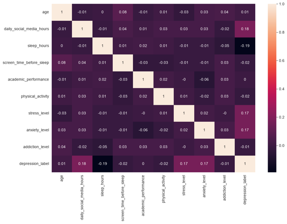

Histograms and boxplots were used to visualise the distributions of numeric columns, which later informed decisions such as scaling strategy. 
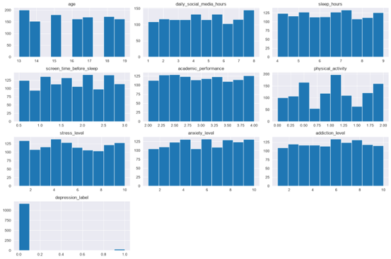
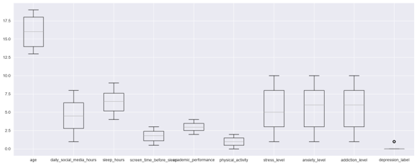

To explore relationships between candidate features and the target variable, bar charts with overlaid confidence intervals were used for categorical variables and kernel density estimate plots were used for numeric variables.
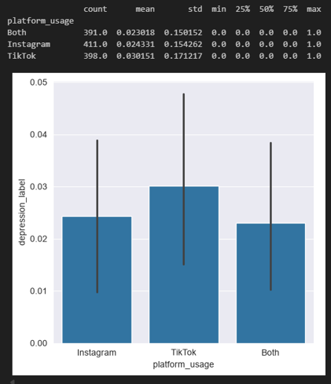
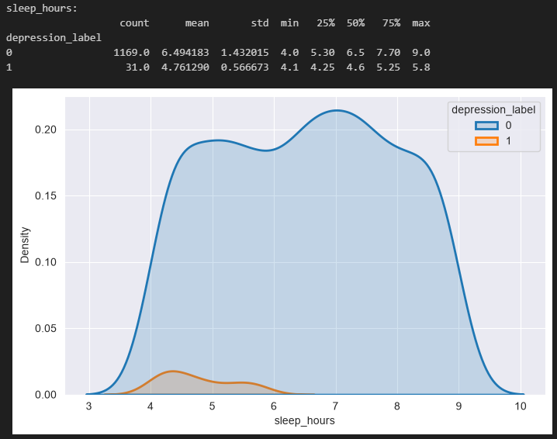

A linear model plot was also used to assess whether the relationship between social media and depression varies across age groups and informed the decision to include an interaction feature to test this relationship formally.
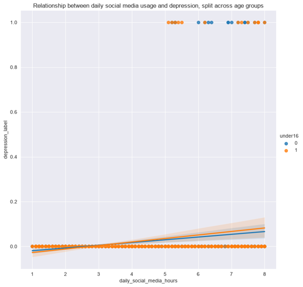 

For the purposes of model evaluation, confusion matrices and ROC curves were visualised.
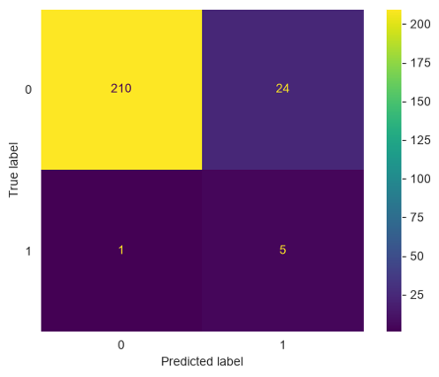
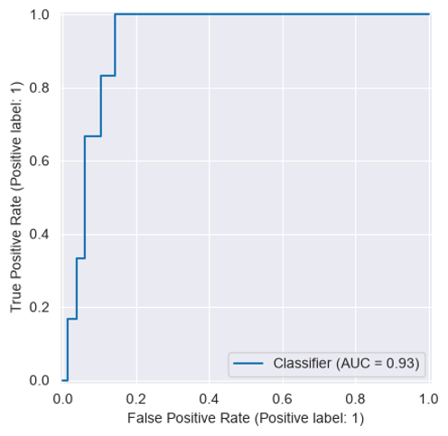

### Data Analytics
The first objective was to test whether depression in teenagers can be predicted through their social media usage among other lifestyle features. This hypothesis would be rejected if the social media usage coefficient was not statistically significant. The second objective was to determine whether the effect of social media usage on depression risk affects under-16s and 16+ teenagers differently. This hypothesis hinges on the statistical significance of the interaction coefficient – if that is not significant then the hypothesis should be rejected.
To model the relationships a classifier was required due to the target variable being a binary field. Several classification models were considered. While more flexible models, such as XGBoost or RandomForest, could potentially perform more effectively in a predictive capacity, Logistic Regression was favoured due to its intuitive interpretability and suitability for testing interaction features (Hosmer, Lemeshow and Sturdivant, 2013) – both factors which were vital to the project objectives.
To ensure confidence in the model, several steps were taken to enhance the robustness of the model. Firstly, the model was trained on a subset of the data and a separate subset was withheld and reserved for evaluation of the model post-training. This splitting of the data helps evaluate whether the model will generalise to unseen data.
Secondly, cross validation was used to tune the model. RandomSearch and GridSearch were both considered. RandomSearch is less computationally expensive for large parameter spaces (Bergstra and Bengio, 2012) however Logistic Regression has a limited number of hyperparameters compared to more flexible classifiers and so GridSearch was appropriate.
Finally, the dataset had a class imbalance with the positive class only occurring in 2.58% of records. Given the severity of this imbalance, two models were trained with different imbalance-handling strategies. The performance and coefficients of both models were similar, giving confidence that the model was robust to imbalance-handling.
The model achieved a Recall of 0.83, meaning that 83% of positive cases are correctly identified, and Precision was 0.17 despite the class imbalance.
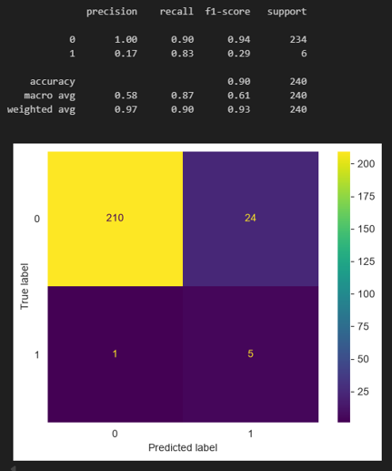

ROC AUC scored 0.93 however this metric can be misleading in imbalanced datasets (Saito and Rehmsmeier, 2015) and so the Average Precision (the area under the Precision-Recall Curve) was considered as well and the model achieved an Average Precision of 0.19. This appears low, however compared to the positive class prevalence of 0.0258 this means the model performs roughly 7.46x better than random guessing.

The coefficients returned by the model showed that the social media usage feature had a coefficient of 2.23. In Logistic Regression, the regression formula is predicting the log odds and then the sigmoid function transforms those log odds into a probability. Therefore to interpret the coefficient we take its exponent and that tells us the odds ratio. e2.23 = 9.31 therefore we can say that for every 1 standard deviation increase in daily social media hours, the odds of depression are multiplied by a factor of 9.31. Due to the presence of the interaction feature, this is the effect of social media for teens aged 16+ (‘under16’ feature == 0). 
To understand how social media effects teenagers under-16 we must also consider the coefficient of the interaction feature, which was -0.13. e-0.13 = 0.88, therefore we can say that for every 1 standard deviation increase in daily social media hours, the odds of depression for under16s increases by a factor 9.31x0.88 = 8.19.
Note that this odds ratio is interpreted in standard deviation units as the coefficients of the numeric features are calculated in the transformed feature space which used the StandardScaler, thereby dividing each by the standard deviation.
This appears to suggest that social media has a larger impact depression risk in teenagers under-16 than on those aged 16+.
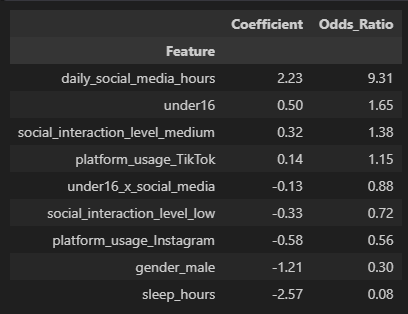

However we must also consider the statistical significance of these coefficients before drawing conclusions and for this statsmodels was used. The model summary provided evidence in favour of the first hypothesis as it suggested that the relationship between social media and depression risk is statistically significant with a p-value of 0.001. However, the p-value of the interaction feature was 0.75 suggesting there is insufficient evidence to support the second hypothesis that the effect of social media on depression risk varies across age groups.
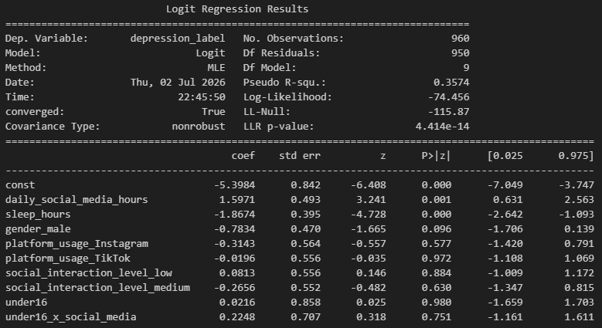

These findings suggest that there is an association between social media usage and depression risk, and that this association is broadly independent of whether the teenage is above or below the age of 16. However, there are a number of limitations to acknowledge. The health data in this dataset are self-reported and therefore may be unreliable or subject to bias (Althubaiti, 2016). It is also impossible to draw conclusions of a causal relationship between social media and depression risk, despite the presence of an association. As an ethical consideration, it is also not known how broad a demographic spectrum is represented in the data and therefore the findings may not generalise to a broader population than those captured in the dataset.

### Appendix 1 - Why are the coefficients interpreted in standard deviations rather than units?
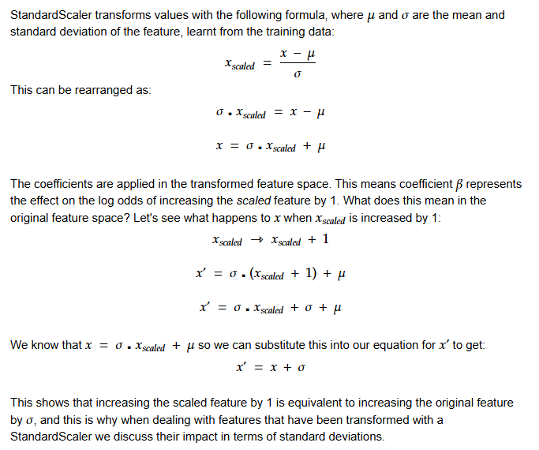

### Appendix 2 - How to interpret interaction coefficients
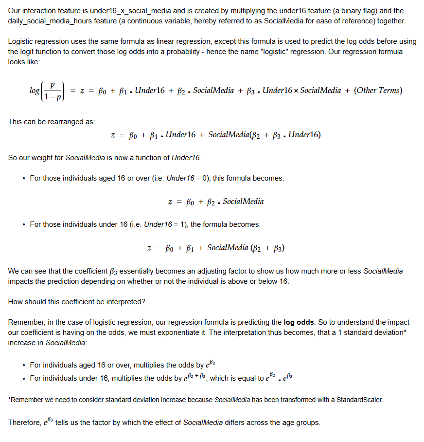

### References
Althubaiti, A. (2016) ‘Information bias in health research: definition, pitfalls, and adjustment methods’, Journal of Multidisciplinary Healthcare, 9, pp. 211–217. Available at: https://doi.org/10.2147/JMDH.S104807 (Accessed: 5 July 2026).

Bergstra, J. and Bengio, Y. (2012) ‘Random search for hyper-parameter optimization’, Journal of Machine Learning Research, 13, pp. 281–305. Available at: https://jmlr.org/papers/v13/bergstra12a.html (Accessed: 5 July 2026).

Department for Science, Innovation and Technology (2026) Social media to be banned for under-16s in landmark government move to give kids their childhood back. Available at: https://www.gov.uk/government/news/social-media-to-be-banned-for-under-16s-in-landmark-government-move-to-givekids-their-childhood-back (Accessed: 5 July 2026).

James, G., Witten, D., Hastie, T. and Tibshirani, R. (2023) An Introduction to Statistical Learning: With Applications in Python. Cham: Springer. Available at: https://www.statlearning.com/ (Accessed: 5 July 2026).

Hosmer, D.W., Lemeshow, S. and Sturdivant, R.X. (2013) Applied Logistic Regression. 3rd edn. Hoboken, NJ: Wiley. Available at: https://books.google.co.uk/books?id=bRoxQBIZRd4C (Accessed: 5 July 2026).

Moscovich, A. and Rosset, S. (2019) ‘On the cross-validation bias due to unsupervised preprocessing’, arXiv preprint arXiv:1901.08974. Available at https://arxiv.org/abs/1901.08974 (Accessed: 5 July 2026).

Saito, T. and Rehmsmeier, M. (2015) ‘The Precision-Recall Plot Is More Informative than the ROC Plot When Evaluating Binary Classifiers on Imbalanced Datasets’, PLOS ONE, 10(3), e0118432. Available at: https://journals.plos.org/plosone/article?id=10.1371%2Fjournal.pone.0118432  (Accessed: 5 July 2026).
